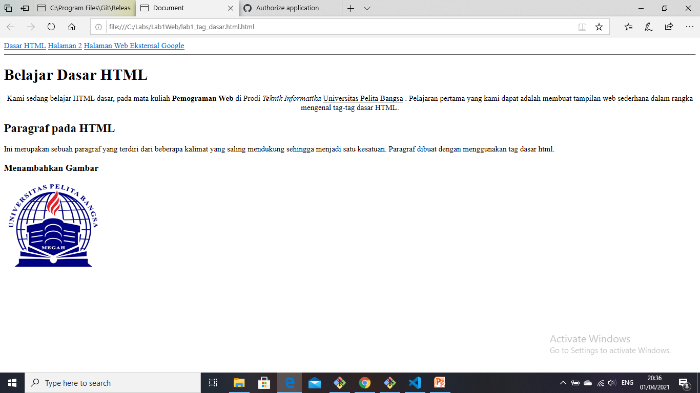

# Lab1Web
## Belajar Tag Dasar HTML
Nama : Dhea Sagita
NIM  : 311910123
### Menjawab Pertanyaan Tugas Praktikum 1 
1 Lakukan perubahan pada kode sesuai dengan keinginan anda, amati perubahannya adakah error ketika terjadi kesalahan penulisan tag? 
Jawab : Ada

2 Apa Perbedaan dari tag < p > dengan tag < br > , berikan penjelasannya!
Jawab : Tag < p > untuk membuat paragraf sedangkan Tag < br > untuk berpindah kebaris sebelumnya

3 Apa perbedaan atribut title dan alt pada tag < img >, berikan penjelasannya!
Jawab : untuk membuat judul gambar, sedangkan alt untuk membuat deskripsi gambar

4 Untuk mengatur ukuran gambar , digunakan atribut width dan height agar tampilan gambar proposional sebaiknya kedua atribut tersebut diisi semua atau tidak? Berikan penjelasannya!
Jawab : iya, karena membuat gambar lebih terlihat proposional, maka sebaiknya menggunakan atribut tersebut

5 Pada link tambahan atribut target dengan nilai atribut bervariasi (_blank,_self,_top,_parent) apa yang terjadi pada masing-masing nilai atribut tersebut?
Jawab : Maka link yang ditambahkan akan mengikuti instruksi dan atribut tersebut

### Membuat Paragraf
Kode tag untuk pargafraf '
'
Ini adalah tampilannya 

![img] (sreenshoot/SS2.png.png)

